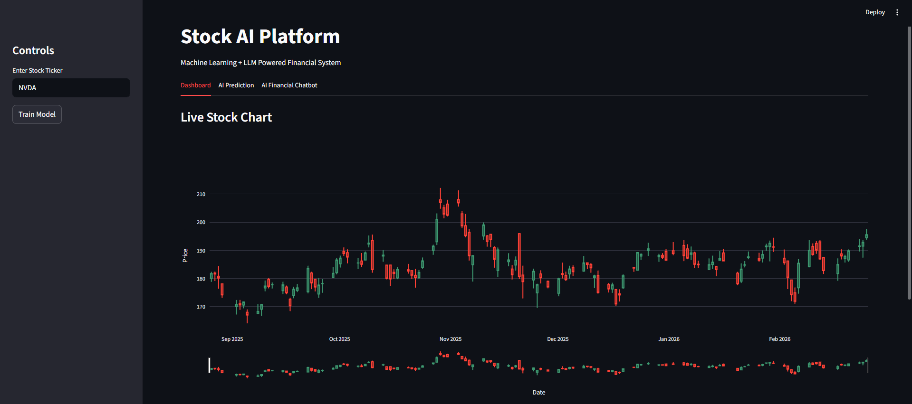
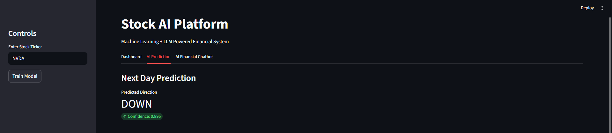
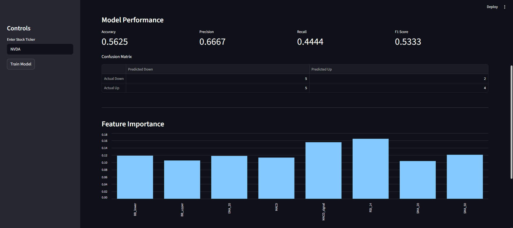
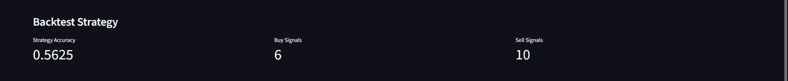
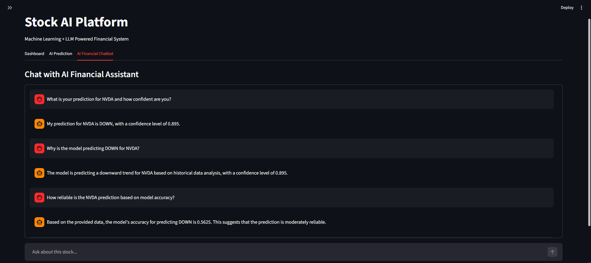
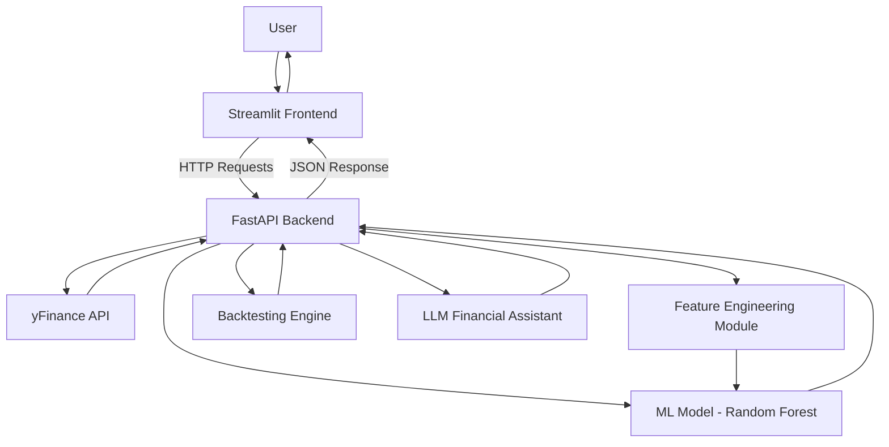

# 📈 Stock AI – ML + LLM Powered Financial Assistant

A full-stack AI-powered stock analysis platform that combines:

- 📊 Time Series Feature Engineering
- 🤖 Machine Learning Forecasting
- 📈 Backtesting Engine
- 🧠 LLM-powered Financial Chatbot
- 🚀 Optimized FastAPI Backend
- 🎨 Streamlit Interactive Dashboard

---

## 🚀 Demo Overview

### 📊 Dashboard


---

### 🔮 AI Prediction


---

### 📈 Model Evaluation (Confusion Matrix + Metrics)


---

### 📈 Backtest Results


---

### 🤖 Financial Chatbot (Streaming)


---

# 🧠 System Architecture



---

# ✨ Features

## 📊 Live Stock Data
- Real-time stock prices
- Historical data
- Cached for performance

## 📈 Technical Indicators
- SMA (20, 50)
- RSI
- MACD
- Bollinger Bands
- Lag Features

## 🤖 Machine Learning Model
- Random Forest Classifier
- Direction Prediction (Up/Down)
- Train/Test Split
- Feature Importance
- Confusion Matrix (DataFrame)
- Backtesting Strategy

## 📉 Backtesting Engine
- Strategy simulation
- Buy/Sell signal count
- Strategy accuracy

## 🧠 LLM Financial Assistant
- Powered by Ollama (llama3)
- Context-aware
- Uses live data + model outputs
- Streaming UI
- Hallucination-controlled prompts

## ⚡ Performance Optimizations
- TTL Caching (cachetools)
- Streamlit caching
- Optimized LLM prompt size
- Logging (loguru)
- Global error handling

---

# 🛠 Tech Stack

### Backend
- FastAPI
- Scikit-learn
- Pandas
- yfinance
- cachetools
- loguru

### Frontend
- Streamlit
- Plotly
- Requests

### AI / LLM
- Ollama
- llama3 (local model)

---

# ⚙ Installation & Setup

## 1️⃣ Clone Repository

```bash
git clone https://github.com/TUSHAR-S-KALE/real-time-stock-forecasting-llm.git
cd stock-ai
```

## 2️⃣ Create Virtual Environment
```bash
python -m venv venv
source venv/bin/activate   # Mac/Linux
venv\Scripts\activate      # Windows
```

## 3️⃣ Install Requirements
```bash
pip install -r requirements.txt
```

## 4️⃣ Install Ollama (LLM)
Download: [Ollama](https://ollama.com/)

Pull model:
```bash
ollama pull llama3
```

## 5️⃣ Run Backend
```bash
uvicorn backend.main:app --reload
```

## 6️⃣ Run Frontend
```bash
streamlit run frontend/app.py
```
## 📊 API Endpoints

| Endpoint | Description |
|-----------|------------|
| `/price/{ticker}` | Live stock price |
| `/history/{ticker}` | Historical data |
| `/train/{ticker}` | Train ML model |
| `/predict/{ticker}` | Next-day prediction |
| `/evaluate/{ticker}` | Model metrics |
| `/backtest/{ticker}` | Strategy simulation |
| `/feature-importance` | Feature ranking |
| `/chat/{ticker}` | AI financial assistant |

---

## 📈 Example Prediction Output

```json
{
  "prediction": "UP",
  "confidence": 0.73
}
```

## 📊 Example Evaluation Output

```json
{
  "accuracy": 0.62,
  "precision": 0.60,
  "recall": 0.65,
  "f1_score": 0.62,
  "confusion_matrix": {
    "Actual Down": {"Predicted Down": 30, "Predicted Up": 12},
    "Actual Up": {"Predicted Down": 15, "Predicted Up": 40}
  }
}
```

## 📌 What This Project Demonstrates

- Time Series Feature Engineering

- Applied Machine Learning

- Model Evaluation & Backtesting

- LLM Integration

- API Design

- Full-Stack Development

- Performance Optimization

- Production-Style Architecture

---

## 📄 License

MIT License
